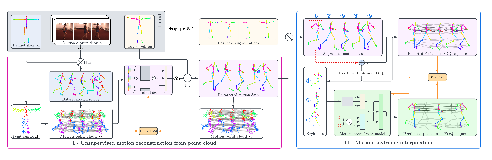

# Point Cloud to Motion Reconstruction Learning
Official implementation of [Motion Keyframe Interpolation for Any Human Skeleton via Temporally Consistent Point Cloud Sampling and Reconstruction](https://arxiv.org/abs/2405.07444) **[ECCV 2024]**



Pre-trained checkpoints can be found [here](https://drive.google.com/file/d/1GJ31cF_zugEePu_xfa-K_PLlRCV2p9cr/view?usp=sharing). Place these folders in the root directory.
# START
Below is the environment setup guide written in `README` format:

---

## Environment Setup

### 1. Install Dependencies
First, install the required dependencies by running the following command:

```bash
pip install -r requirements.txt
```

### 2. Clone PyTorch3D Repository
Next, clone the `PyTorch3D` repository to your local machine:

```bash
git clone https://github.com/facebookresearch/pytorch3d.git
```

### 3. Install PyTorch3D
Navigate to the `PyTorch3D` directory and run the installation script:

```bash
cd pytorch3d
python setup.py install
```

### 4. Verify Installation
After installation, you can verify if the installation was successful by running:

```bash
python -c "import torch; import pytorch3d; print('PyTorch version:', torch.__version__); print('PyTorch3D version:', pytorch3d.__version__)"
```

If the installation is successful, the command will output the versions of PyTorch and PyTorch3D.

---

## Notes
- Ensure your Python version meets the requirements (Python 3.8 or higher is recommended).
- If you encounter any issues during installation, refer to the [PyTorch3D official documentation](https://github.com/facebookresearch/pytorch3d) for further assistance.

---

## Training

First, configure [LaFAN1](https://github.com/ubisoft/ubisoft-laforge-animation-dataset) and [Human3.6M](http://vision.imar.ro/human3.6m/description.php) directory locations in `config.json`. In addition, one motion file from CMU MoCap is needed for the `cmu_skeleton` setting. Please use the [BVH version](https://sites.google.com/a/cgspeed.com/cgspeed/motion-capture?authuser=0) for this implementation

PC-MRL is trained in two stages. Run `train_pointcloud.py` first, and then run `train_inpainter.py` afterwards. Ensure that the point cloud processing model checkpoint from `train_pointcloud.py` is properly referenced in `config.json`.

## Evaluation

An example evaluation script is provided in `eval_inpainter.py`. Ensure the CMU MoCap motion data path is correctly set in `config.json`.
